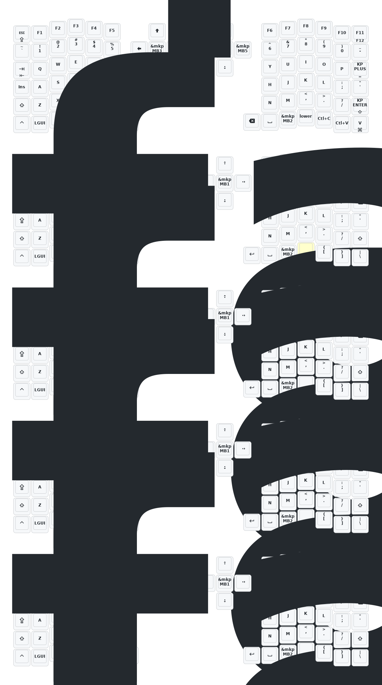

Mitmit 84 keys layout include Ano switch (5 buttons + rotary encoder) on both side. 

***Direct Key Notes

  A direct key must be placed on a separate row/column outside the main matrix.
  Each side's .overlay file must define the direct key separately.

Left Side Configuration:

  -Choose the desired row using 
  
    row-offset = <target row>;
  
  -Set the col-offset based on how many columns the key is shifted on that row.

Right Side Configuration:

  Depends on the direct key's position relative to the right shield:
  
  -If the direct key is to the left of the right shield, use:
  
    row-offset = <target row - 1>;
    
  -If it's not to the left (same or right), use:
  
    row-offset = <target row>;
    
  -On the selected row, start counting columns from (&default_transform { col-offset = <X>; }) to Adjust the col-offset to reach the target position.
   

